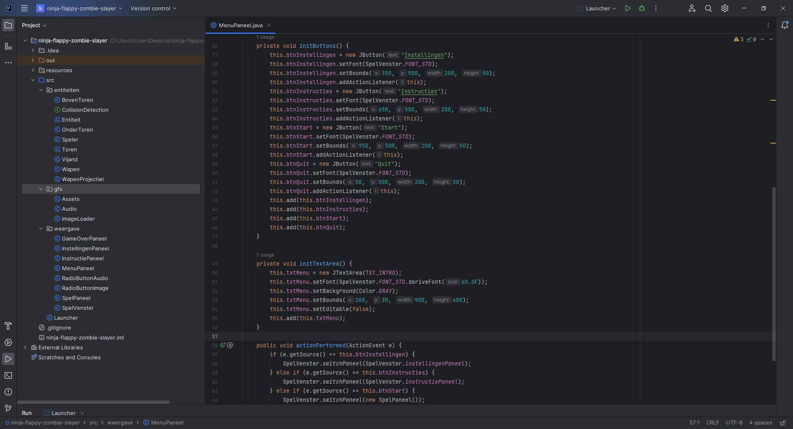

# Ninja Flappy Zombie Slayer Game 🦸‍♂️

Welcome to the Ninja Flappy Zombie Slayer Game – my early adventure into application development using Java Swing. This project was initially created as part of my first bachelor's degree project in engineering. While this project may not be a masterpiece, it reflects my initial steps into the world of application development and demonstrates my commitment to learning and improvement. 🎓

## 🎮 Game Overview
In this simple game, you'll embody a ninja armed with kunais, defending against zombies and navigating perilous towers. The game offers a simple yet enjoyable experience:

- **Ninja vs. Zombies**: Earn points by eliminating zombies with your deadly kunais.
- **Tower Navigator**: Navigate treacherous towers, mastering their varying heights.
- **Customization**: The Options Menu allows you to tweak the gaming experience by adjusting tower heights, game speed, maps, and soundtracks.
- **Instruction Menu**: Don't forget to check the Instruction Menu for essential gameplay tips!

## 🚀 What I've Learned
During the development of the Ninja Flappy Zombie Slayer Game, I embarked on a journey of growth and exploration:

- 💡 **Java Foundations**: This project marked my early exploration of Java, helping me grasp essential programming concepts.
- 🏗️ **My First Application**: This game is a testament to my first steps in creating a Java Swing application.
- 🏛️ **MVC Inspiration**: Although not a full-fledged MVC (Model-View-Controller) implementation, I attempted to structure the game's components, introducing the "VIEWCONTROLLER" concept as an early attempt to separate concerns.
- 🎨 **UI/UX Design**: The game may be simple, but it showcases my enthusiasm for designing user-friendly interfaces.

## 🔌 Custom RadioButtons
To enhance the user interface and provide a more interactive experience, I created my own custom `RadioButton` classes: `RadioButtonImage` and `RadioButtonAudio`. These classes are based on the inheritance principle, enabling me to easily pass parameters such as text and image (or audio) in their constructors. This customization allows for a seamless integration of images and audio options within the game's Options Menu.

## 👾 Getting Started
1. Clone this repository to your local machine.
2. Run the game by executing the Launcher lass.

## 👨‍💻 Contributing
While this project serves as a testament to my early steps in the world of application development, it's also an open invitation to the community. Your contributions, enhancements, and bug fixes are greatly appreciated!

## 📜 License
This project is licensed under the MIT License - see the [LICENSE.md](LICENSE.md) file for details.

## 📺 Screenshots
Here are some glimpses of the Ninja Flappy Zombie Slayer Game:

### Instruction Menu

### Options Menu

### Game with Midnight City Map

### Game With Good Morning Map

### Assets Class Responsible for Loading Images and Audio

### MenuPaneel Class Responsible for Drawing the Main Menu

Dive into the world of the Ninja Flappy Zombie Slayer Game and witness my journey as a budding application developer! 🌟
